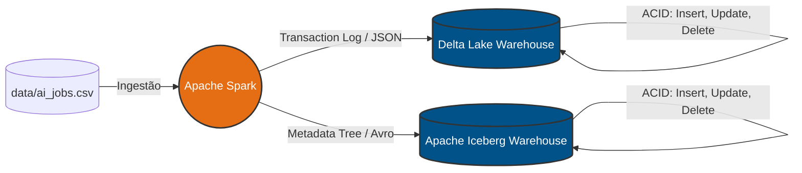

# Engenharia de Dados — Delta Lake & Apache Iceberg

[](https://www.python.org/downloads/)
[](https://github.com/astral-sh/uv)
[](https://Xandetds.github.io/Apache-spark/)

Repositório modelo para desenvolvimento de projetos da disciplina de Engenharia de Dados do curso de Engenharia de Software da UNISATC. Demonstração prática de um ambiente Apache Spark local processando dados com duas tecnologias de tabelas abertas (open table formats): **Delta Lake** e **Apache Iceberg**.

---

## Desenho de Arquitetura

O fluxo de dados consiste na ingestão de um dataset em formato bruto (CSV) processado na memória pelo Apache Spark e persistido fisicamente em duas arquiteturas de Lakehouse distintas para fins de comparação.



---

## Pré-requisitos e Ferramentas

| Componente | Detalhe |
|---|---|
| Sistema Operacional | Ubuntu (WSL 2) recomendado |
| Linguagem | Python 3.11+ |
| Runtime | Java 17 (OpenJDK) — obrigatório para o Spark |
| Gerenciador de Pacotes | `uv` |
| Motor de Processamento | Apache Spark (PySpark) |
| Formatos de Armazenamento | Delta Lake & Apache Iceberg |
| Ambiente de Desenvolvimento | JupyterLab |
| Documentação | MkDocs + mkdocs-material |

---

## Instalação

### 1. Clonar o repositório

```bash
git clone https://github.com/Xandetds/Apache-spark.git
cd Apache-spark
```

### 2. Instalar o Java 17

O PySpark requer o Java instalado e a variável `JAVA_HOME` configurada. No Ubuntu/WSL:

```bash
sudo apt update && sudo apt install -y openjdk-17-jdk
echo 'export JAVA_HOME=/usr/lib/jvm/java-17-openjdk-amd64' >> ~/.bashrc
echo 'export PATH="$JAVA_HOME/bin:$PATH"' >> ~/.bashrc
source ~/.bashrc
```

### 3. Instalar o uv e sincronizar as dependências

```bash
curl -LsSf https://astral.sh/uv/install.sh | sh
source ~/.bashrc
```

O `uv` lerá o `pyproject.toml` e instalará o ambiente virtual isolado (`.venv`):

```bash
uv sync
```

---

## Executar Localmente

Para explorar os notebooks, inicie o servidor do JupyterLab pelo `uv`:

```bash
uv run jupyter lab
```

Acesse o ambiente no navegador em `http://localhost:8888`.

> **Importante:** Execute as células em ordem. A primeira célula de cada notebook pode demorar pois o Spark precisa baixar os conectores do Delta/Iceberg via Maven. Certifique-se de encerrar o Kernel de um notebook (`Kernel > Shut Down Kernel`) antes de abrir o outro para evitar conflito de portas no Spark local.

---

## Documentação (MkDocs)

Toda a documentação teórica e técnica está na pasta `docs/`.

### Visualizar localmente

```bash
uv run mkdocs serve
```

Acesse `http://127.0.0.1:8000` no navegador.

### Publicar no GitHub Pages

```bash
uv run mkdocs gh-deploy
```

---
**Documentação completa ->** https://xandetds.github.io/Apache-spark/

---

## Colaboração

1. Abra uma issue para discutir sua feature ou bug.
2. Crie um branch:
   ```bash
   git checkout -b feature/nome-da-sua-feature
   ```
3. Faça suas alterações e commit seguindo o [Conventional Commits](https://www.conventionalcommits.org/).
4. Envie um pull request para `main`.
5. Aguarde revisão e merge.

---

## Versionamento

Utilizamos o GitHub para o versionamento semântico do código. Para a documentação das operações ACID, as bibliotecas utilizadas mantêm o controle de versão de dados interno (Time Travel no Delta Lake e Snapshot Tracking no Apache Iceberg).

---

## Autores

| Nome | Papel | GitHub |
|---|---|---|
| Alexandre Tibes | Engenharia de Dados e Infraestrutura | [@Xandetds](https://github.com/Xandetds) |
| Roger Balcevicz | Desenvolvimento | [@Roger Balcevicz](https://github.com/Roger-Balcevicz) |
| Murilo Salvan | Documentação e Estruturação | [@omrl](https://github.com/omrl) |

---

## Licença

Este projeto está sob a licença MIT — veja o arquivo [LICENSE](LICENSE) para detalhes.

---

## Referências

- [Documentação Oficial do Apache Spark](https://spark.apache.org/docs/latest/)
- [Delta Lake Docs](https://docs.delta.io/)
- [Material for MkDocs](https://squidfunk.github.io/mkdocs-material/)
